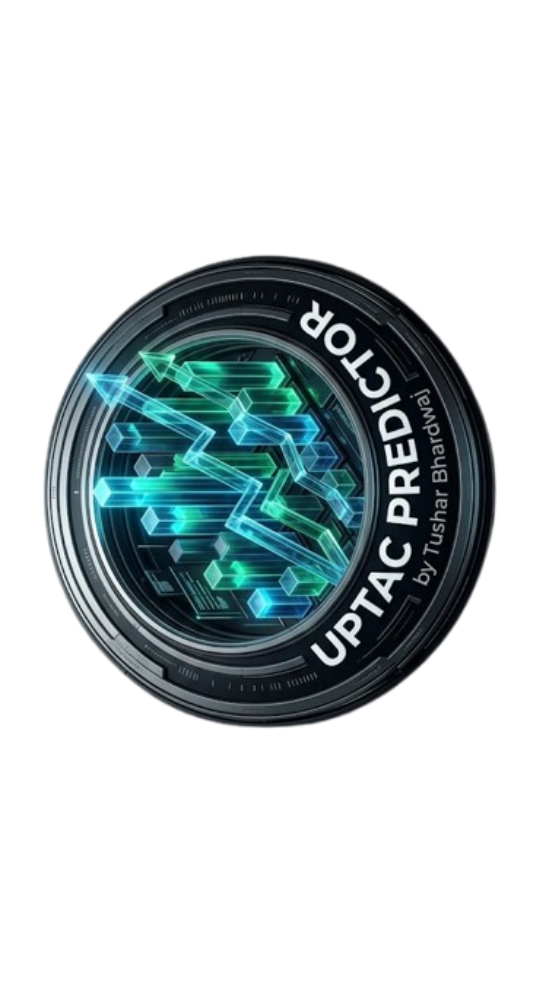

# 🎓 UPTAC B.Tech. Counselling Platform (v2)

<div align="center">
  
  <p><strong>The ultimate full-stack platform for analyzing, predicting, and organizing UPTAC B.Tech. Admissions.</strong></p>
  
  [](https://github.com/0Tusharbhardwaj)
  [](https://reactjs.org/)
  [](https://tailwindcss.com/)
  [](https://nodejs.org/)
  [](https://www.mongodb.com/)
</div>

---

## 🌟 About The Project

The **UPTAC B.Tech. Counselling Platform** is a full-stack web application designed to help engineering aspirants navigate the complex UPTAC counseling process. Upgraded with a **Clean SaaS / Glassmorphism** aesthetic, this tool replaces static spreadsheets with an interactive, high-performance web experience.

### ✨ Key Features
- 🔍 **Real-Time Dynamic Filtering:** Filter historical cutoffs instantly by Institute, Program, Category, Quota, and Round.
- 📊 **Branch Comparison Analytics:** Click 'Compare' to render a dynamic Bar Chart comparing closing ranks across different branches of a selected college.
- 📋 **Counseling Flow Manager:** A built-in drag-and-drop drawer. Add colleges to your personalized choice list, reorder them based on your preferences, and track your prospects.
- 📄 **Professional PDF Export:** Instantly export your carefully ordered choice list into a clean, well-formatted PDF (complete with a "Made by Tushar Bhardwaj" watermark and official disclaimers).
- ⚡ **Full-Stack Architecture:** Powered by a Node.js/Express backend securely querying an indexed MongoDB database of over 8,000 cutoff records.

---

## 🛠️ Tech Stack

**Frontend:**
- React 18, Vite, TypeScript
- Tailwind CSS (Glassmorphism design)
- `@dnd-kit` for drag-and-drop list interactions
- `recharts` for interactive comparison analytics
- `jsPDF` & `jspdf-autotable` for professional document generation

**Backend:**
- Node.js & Express.js
- MongoDB & Mongoose (Indexed queries)
- TypeScript

---

## 🚀 Local Development Setup

### 1. Clone the repository
```bash
git clone https://github.com/0Tusharbhardwaj/uptac-upgraded.git
cd uptac-upgraded
```

### 2. Frontend Setup
```bash
npm install
npm run dev
```
The frontend will start at `http://localhost:5173`.

### 3. Backend Setup
```bash
cd backend
npm install
```
Create a `.env` file inside the `backend/` directory:
```env
PORT=5000
MONGO_URI=mongodb+srv://<username>:<password>@cluster.mongodb.net/uptac-orcr
```

Run the migration script to populate your live MongoDB with the historic data:
```bash
npx ts-node src/migrate.ts
```

Start the backend server:
```bash
npm run dev
```

---

## 🌎 Deployment Guide

### Deploying the Backend on Render
1. Go to [Render](https://render.com) and create a **New Web Service**.
2. Connect your GitHub repository.
3. Configure the settings:
   - **Root Directory:** `backend`
   - **Build Command:** `npm install`
   - **Start Command:** `npm run start`
4. Add your Environment Variables:
   - `MONGO_URI`: `mongodb+srv://...`
   - `PORT`: `5000`
5. Click **Create Web Service**. 

*Note: Update your frontend `App.tsx` and `BranchComparisonChart.tsx` to use the new Render backend URL instead of `http://localhost:5000`.*

### Deploying the Frontend on Vercel
1. Go to [Vercel](https://vercel.com) and click **Add New Project**.
2. Import this GitHub repository.
3. Keep the **Root Directory** as the root (`/`).
4. Keep the Framework Preset as **Vite**.
5. Click **Deploy**. Vercel will automatically build the React app and give you a live HTTPS domain!

---

## 📜 License & Disclaimer
This tool displays historical data for informational purposes only. Final admissions and cutoffs depend on various factors. Always refer to official UPTAC notifications for the most accurate information.

> Designed & Developed by **Tushar Bhardwaj**
